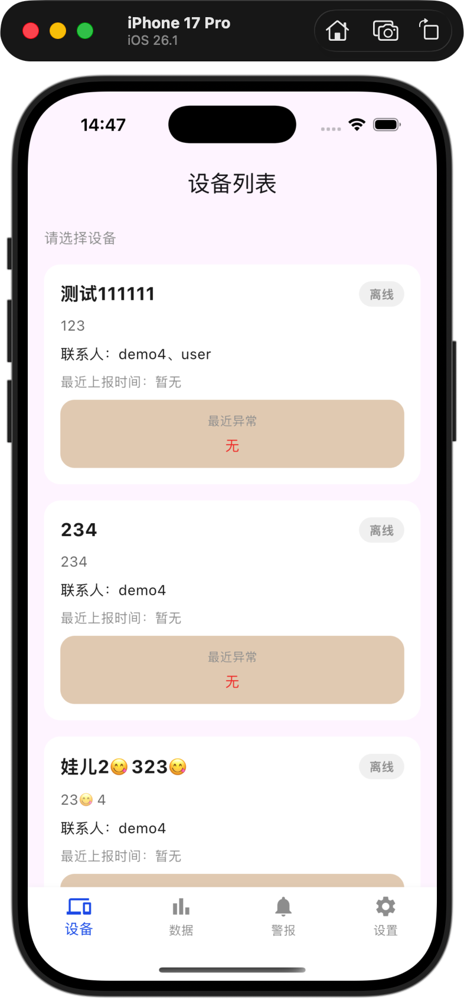
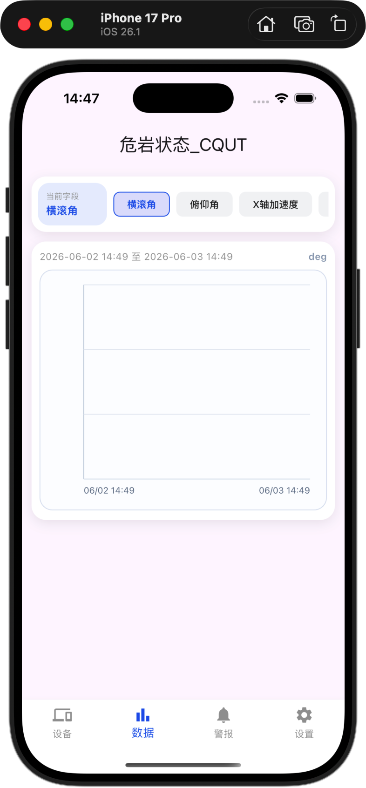
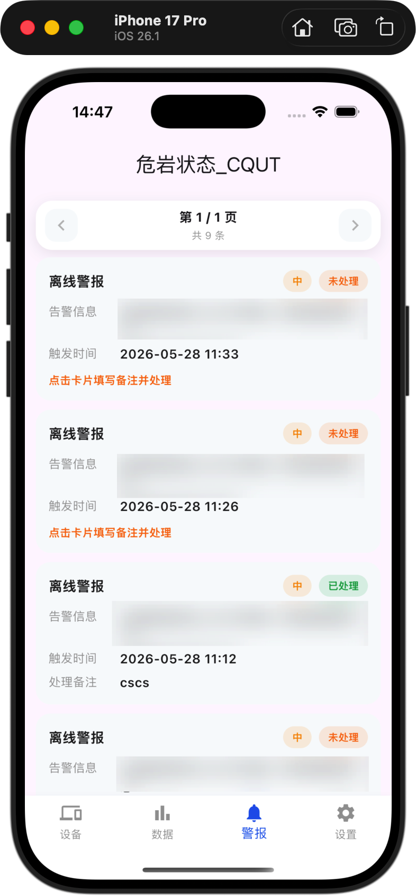

# Stm_Cqut

`Stm_Cqut` 是一个面向监测设备管理场景的 Flutter 客户端，当前实现聚焦于设备总览、监测数据趋势查看、警报记录处置以及登录态维持等核心能力。项目采用移动端多标签页交互，前端通过后端接口获取设备、时序数据和警报信息，并使用本地安全存储保存访问令牌。

## 界面示例

| 设备列表 | 数据趋势 | 警报记录 |
| --- | --- | --- |
|  |  |  |

## 目录结构

```text
lib/
├── main.dart                     # 应用入口
├── tab_view.dart                 # 底部四标签主框架
├── app_dialog.dart               # 全局弹窗封装
├── Services/
│   └── api.dart                  # API 常量、Dio 实例、鉴权与刷新逻辑
├── Manager/
│   ├── AuthService.dart          # 登录与用户信息服务
│   ├── DeviceService.dart        # 设备、趋势、警报相关服务
│   └── auth_storage.dart         # token / refresh_token 本地存储
├── Model/
│   ├── user.dart                 # 用户模型
│   ├── device.dart               # 设备卡片与最近警报模型
│   ├── data.dart                 # 字段配置与时序数据模型
│   └── alarms.dart               # 警报分页与记录模型
└── View/
    ├── launch_view.dart          # 启动页，负责登录态恢复
    ├── login_view.dart           # 登录页
    ├── device_view.dart          # 设备列表页
    ├── data_view.dart            # 趋势数据页
    ├── alarms_view.dart          # 警报记录页
    ├── settings_view.dart        # 设置页
    └── DataComponent/
        ├── data_field_bar.dart   # 字段横向选择条
        └── data_trend_chart.dart # 自定义趋势图组件
```

## 快速开始

### 运行步骤

1. 安装依赖

```bash
flutter pub get
```

2. 配置后端地址

当前 `lib/Services/api.dart` 中的 `baseUrl` 为空字符串，运行前需要改成实际服务地址，例如：

```dart
static const String baseUrl = 'https://your-api-host';
```

3. 启动应用

```bash
flutter run
```

### 常用构建命令

```bash
flutter build apk
flutter build ios
flutter build web
```
